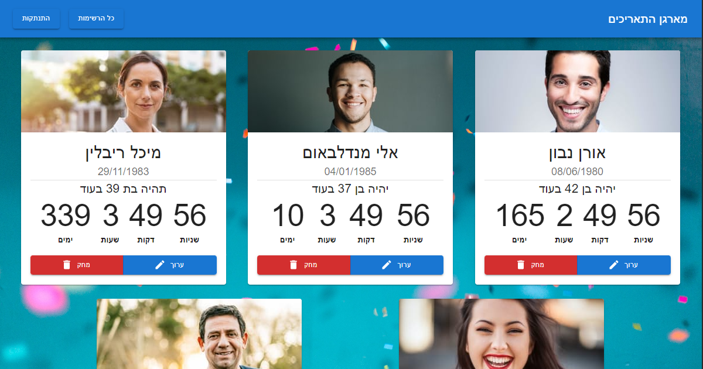
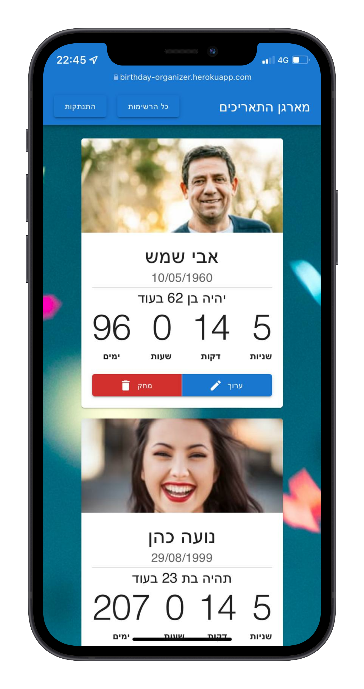
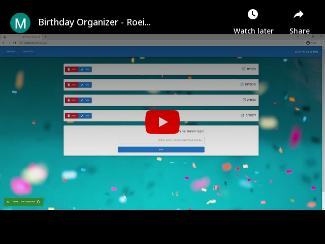

# Birthday Organizer - Platform built with the MERN stack

<h4>A platform that organizes birthdays by groups, and counts down to the dates. It has cool features like authentication, authorization, single-page application, responsive design, full CRUD operations & upload photos.</h4>


<p align="center">
  
  
</p>
<p align="center">
  <a href="https://www.youtube.com/watch?v=8yuLlZgGuRs"></a>
</p>

## Website

https://birthday-organizer.herokuapp.com/

## Features

- Authentication
- Authorization
- Single-page application
- Responsive design
- Full CRUD operations (for groups and group members)
- Upload photos with Cloudinary and store them in the server

## Usage

### Env Variables

Create a .env file in the root folder and add the following

```
DB_URL = your mongodb uri
JWT_SECRET = your own string
CLOUDINARY_CLOUD_NAME = your cloudinary cloud name
CLOUDINARY_KEY = your cloudinary key
CLOUDINARY_SECRET = your cloudinary secret
SECRET = your own string
```

### Install Dependencies (Client & Server)

```
npm install
cd client
npm install
```

### Run

```
# Run server
npm start

# Run client
cd client
npm start

# To run client & server you should split the terminal and run the commands listed above
```

## Build & Deploy

```
# Create frontend prod build
cd client
npm run build
```

There is a Heroku postbuild script, so if you push to Heroku, no need to build manually for deployment to Heroku
